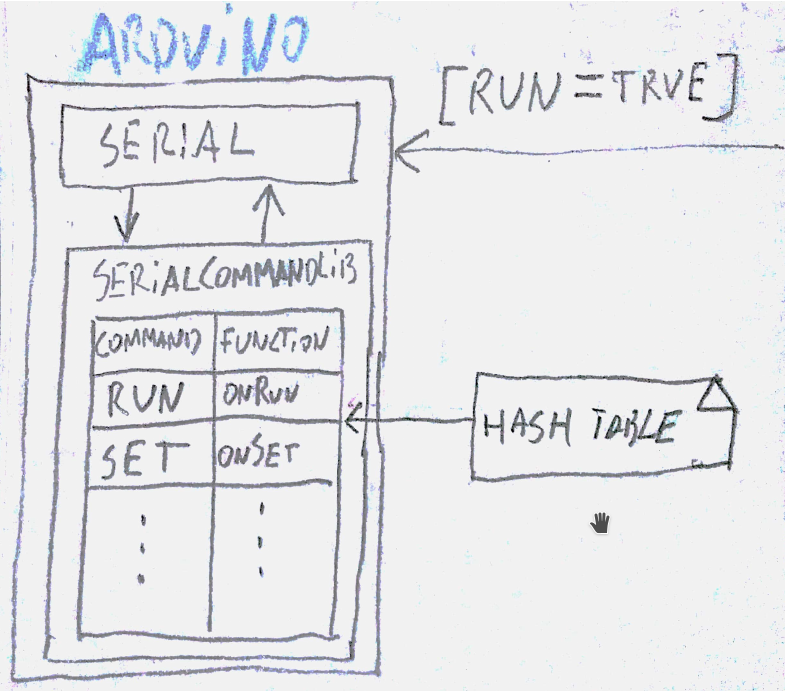
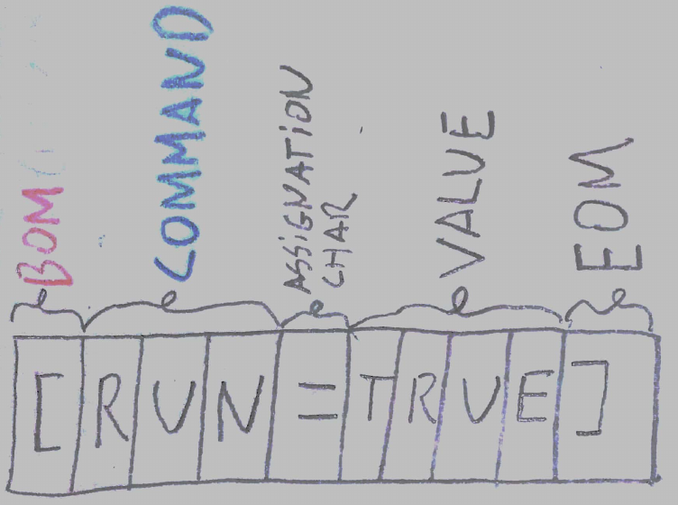

<p align="center">
  <h3 align="center">SerialCommandLib</h3>

  <p align="center">
    The simple way to communicate with the arduino via serial
  </p>
</p>

<br>

##### Problem
Although there are libraries for handling commands via serial, these do not allow to configure its operation in depth.

##### Characteristics:
- Allows you to send and receive commands using HardwareSerial or SoftwareSerial.
- Associate commands to functions.

This library allows you to work configure the following:
* The structure of the command:
* The behavior of the answers (ACK, NACK)


##### Simple example

This code allows to associate the RUN and SET commands to the onRun and onSet functions respectively. That is, when the RUN command arrives, the onRun function is executed (the same for SET command and onSet function).

```c++
#include <Arduino.h>
#include <SoftwareSerial.h>
#include "SerialCommandLib.h"

SerialCommandLib serialCMD;

/** Callback functions **/
int onRun(String saludo);
int onSet(String saludo);

void setup()
{
    Serial.begin(9600);

    // 1 - Create config 
    SerialCommandConfig cfg;

    // 2 - Set serial streams objects
    cfg.HW_IN_Stream = &Serial;  // Only if you need to read    
    cfg.HW_OUT_Stream = &Serial; // Only if you need to write
    cfg.USE_HW_SERIAL = true;    // Not necessary, is true by default

    // 3 - Set config
    serialCMD.setConfig(cfg);

    // 4 - Asociate command with functions           
    serialCMD.addCommandCallback("RUN", &onRun);  
    serialCMD.addCommandCallback("SET", &onSet);

    // 5- You can immediately start writing and reading commands
    serialCMD.sendCommand("INIT_EXAMPLE", "anyvalue");
    // serialCMD.readCommand();

    /**
     * To test this sketch send a serial message to this arduino, such as:
     * [SET=true] or [RUN=anyvalue]
     */ 
}

int onRun(String value){
    Serial.println("main -> run: RUN:"+value);
    return 1;
}

int onSet(String value){
    Serial.println("main -> run: SET:"+value);
    return 1;
}

void loop(){   
    String cmd = serialCMD.readCommand();
}
```
<br><br>
This diagram shows a diagram of the hash table used to associate the commands to the functions.


<br><br>
###### Command message format:



